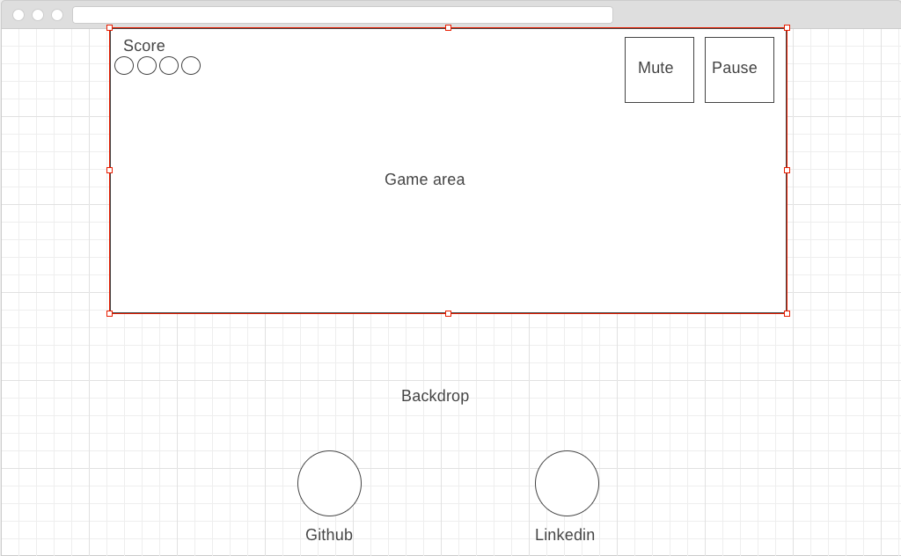

# Slipstream

## Background

This will be an infinite runner type game based on vector runner remix, an online HTML5 game. Slipstream is a one player game, that will utilise a "game window" (most likely an HTML5 canvas element) for most of the game functionality, where the player will control a "vehicle". The rules of the game are as follows:

1) The game window will consist of multiple platforms, which will be at random points on the X and Y axis of the game window.
2) The user earns points both by continuing driving, and by collecting "power cubes"
3) The user has 5 lives. Lives are lost by bumping into obstacles, or by falling off the map
4) Obstacles are positioned on the platforms, and users must jump over these obstacles to avoid them.

## Functionality & MVP  

### In game Functionality
Players will

- Have a score based on the progression of the game
- Jump and double jump
- Have lives/lose lives
- Collect power cubes

### Ancillary Functionality
Slipstream players will be able to (outside of the in-game):

- Pause the game
- Toggle the volume of the background music and sound effects
- Restart the game
- Access an about modal window, with instructions.

## Wireframes

Slipstream will be run on a single page, with a game window. Additionally, this page will contain links to my Linkedin and Github.

## Architecture and Technologies
Slipstream will be implemented using the following technologies:

- JavaScript for the game logic
- Jquery for certain button inputs (or maybe my own GrabJS library)
- HTML5 Canvas for rendering the platforms and the graphics
- Webpack for bundling
- PXloader for handling my assets
- Perhaps the Jquery sprite animation library, for direction changing

The following scripts will be used in this project:
- vehicle.js - this will keep track of the vehicle object and will be partly responsible for any collisions
- board.js - this will be used for the board and the platform logic
- obstacle.js - this will be used for rendering all of the obstacles
- power-cube.js - this will be used for rendering the power cubes

### Implementation Timeline

**Day 1**:
Setup the "game window". This would include the HTML5 canvas, and the platforms. Start working on rendering the obstacles, the vehicle, and the power cubes.

**Day 2**:
Add collisions between the vehicle and the obstacles, as well as the logic for when the player falls off a platform. Add the jump functionality, as well as the double jump functionality.

**Day 3**:
Add a scoring system that will update as intended, as well as the lives system. Get sound effects. Try implement scaling speed.

## Bonus features

- Saving high scores
- Turbulence mode
- Scaling difficulty
